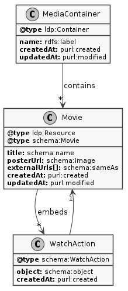

# Documentation

This documentation is intended for developers who want to work with the project locally. Or maybe you're just curious and want to learn more about what's under the hood. If you're familiar with Solid and only want to know how the app interacts with your POD, you only need to read the [Data schema](#data-schema) section.

In any case, this is not a comprehensive documentation but it should suffice to give you an overview of the project to start tinkering. By all means, let [me](https://noeldemartin.com) know if there is anything you'd like to see explained in more detail.

PRs, issues and comments are welcome :).

## Table of contents

- [Technology](#technology)
- [Data schema](#data-schema)
- [Architecture](#architecture)
- [Development](#development)
- [Testing](#testing)
- [Work journal](#work-journal)

-----

## Technology

The core technologies used in this project are the following:

- [Vue](https://vuejs.org/)
- [Vuex](https://vuex.vuejs.org/)
- [Vue Router](https://router.vuejs.org/)
- [Vue CLI](https://cli.vuejs.org/)
- [TailwindCSS](https://tailwindcss.com/)
- [Soukai](https://soukai.js.org/)
- [Soukai Solid](https://github.com/NoelDeMartin/soukai-solid)
- [Inrupt's Auth Client](https://github.com/inrupt/solid-client-authn-js/)
- [TypeScript](https://www.typescriptlang.org/)
- [Jest](https://jestjs.io/)
- [Cypress](https://www.cypress.io/)

In order to understand the basic functionalities, you should at least be familiar with [Vue](https://vuejs.org/) and [Soukai](https://soukai.js.org/).

## Data schema

This diagram is a representation of the [Soukai models](https://soukai.js.org/guide/defining-models.html) used in the app, connected by [Soukai relationships](https://soukai.js.org/guide/defining-models.html#relationships).



| Prefix     | Url                                     | Documentation                        |
| ---------- | --------------------------------------- | ------------------------------------ |
| ldp        | http://www.w3.org/ns/ldp#               | https://www.w3.org/ns/ldp            |
| purl       | http://purl.org/dc/terms/               | http://purl.org/dc/terms             |
| rdfs       | http://www.w3.org/2000/01/rdf-schema#   | https://www.w3.org/TR/rdf-schema     |
| schema     | https://schema.org/                     | https://schema.org                   |

The application looks for an `solid:instanceContainer` of `schema:Movie` within the [private type index](https://github.com/solid/solid/blob/master/proposals/data-discovery.md#unlisted-type-index) and loads it as a `MediaContainer` model. If such resource doesn't exist, a new container will be created using the `/movies` url. When the container is created, it's declared as a container of `schema:Movie` and `schema:WatchAction` in the type index so that subsequent sessions and other applications can find it.

Each movie is written in a separated document within the container, and the same document is used to write watch actions related with the movie.

## Architecture

The main modules that make up the application are the following:

- **Services:** Singleton instances that manage a global aspect of the application. Each of these services may has a Vuex module associated, and interactions with the module are encapsulated within the service (components never use Vuex directly). These services are globally accessible on each Vue component prefixed with a `$`. For example `$media`, `$auth`, `$ui`, etc. You'll find the core logic of the application in these classes.

  Three services to highlight are `Media`, `Auth` and `UI`. `Media` manages the collection of movies, `Auth` manages authentication and session status; and `UI` manages interactions with the application layout and the lifecycle of dynamic components such as modals. You will find all the services at `src/services`.

- **Models:** Models encapsulate data entities and behaviour. There are two types of models: user models, used to encapsulate data for each authentication mode (Solid and browser storage); and Soukai models, used to encapsulate application entities (movies, watch actions, etc.). You will find all the models at `src/models`.

- **Pages:** Application pages are root components within the application shell, managed by the Vue router. You will find them at `src/routing/pages`. Check also the `src/routing/index.ts` file to see how the application handles urls.

- **Components:** Except the pages we just described, all the Vue components can be found under `src/components`. There are 4 types of components.

  Base components are available globally and are prefixed with `Base`. They can be found within `src/components/base` and are loaded automatically.

  Modals can be found within `src/components/modals` and they should be open using the UI service's `openModal` method. For example, to open a Movie modal you would call `$ui.openModal(MovieModal, { movie })`.

  Application shell components are directly under `src/components` prefixed with `App`. These are components used to build the application layout and dynamic content such as snackbars or search results.

  And finally, components that don't fit any of the other categories are found under `src/components` without any particular prefix.

- **Workers:** Web Workers are used to perform intensive operations in a separate thread in order to avoid freezing the UI. There are two parts to any worker, the worker code and the runner code (the application script that communicates with the worker). In order to improve message passing and take advantage of Typescript's type safety, these are encapsulated in classes that declare the interfaces and listener for each task. Workers code is found under `src/workers`.

## Development

To run the application locally, clone this repository and execute the following commands:

```sh
npm install
npm run serve
```

That will work for the most part, but in order to use search you need to obtain a [TMDB api key](https://developers.themoviedb.org/3/getting-started/introduction). Once you have it, copy the `.env.example` file to `.env.local` and update the `VUE_APP_TMDB_API_KEY` variable with your key.

This application has only been tested with the node version listed in `.nvmrc`, so make sure that you're using the same version for development. To make this easier, you can use [nvm](https://github.com/nvm-sh/nvm).

If you want to try an online deployment of the development version, it can be accessed here: [media-kraken.netlify.com](https://media-kraken.netlify.com)

## Testing

There are some unit tests in files ending with `.test.ts`, but most of the behaviour is tested with Cypress in integration tests.

Unit tests can be run executing `npm test`, and integration tests can be run executing `npm run cy:test`.

It can also be useful for debugging to execute these tests in a browser. In order to do that, you can launch the application with a testing environment running the `npm run test:serve` command and open the Cypress client with `npm run cy:open`.

## Work journal

I have been journaling during the development process, you can read about the evolution of the application and get more in-depth information. However, not all of these tasks are exclusively about this app. If you're only interested about it, search for "Kraken" and you should find everything related.

- [Implementing a Media Tracker using Solid](https://noeldemartin.com/tasks/implementing-a-media-tracker-using-solid)
- [Housekeeping](https://noeldemartin.com/tasks/housekeeping)
- [Implementing a Recipes Manager using Solid](https://noeldemartin.com/tasks/implementing-a-recipes-manager-using-solid)
